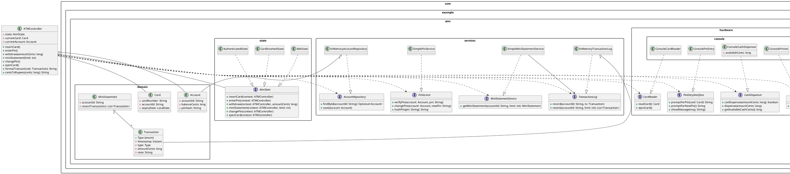

```plantuml
@startuml
skinparam packageStyle rectangle

package "com.example.atm.domain" {
  class Account {
    -accountId: String
    -balanceCents: long
    -pinHash: String
  }
  class Card {
    -cardNumber: String
    -accountId: String
    -expiryDate: LocalDate
  }
  class Transaction {
    +Type {enum}
    -timestamp: Instant
    -type: Type
    -amountCents: long
    -note: String
  }
  class MiniStatement {
    -accountId: String
    -recentTransactions: List<Transaction>
  }
}

package "com.example.atm.hardware" {
  interface CardReader {
    +readCard(): Card
    +ejectCard()
  }
  interface PinEntryInterface {
    +promptForPin(card: Card): String
    +promptForNewPin(): String
    +showMessage(msg: String)
  }
  interface CashDispenser {
    +canDispense(amountCents: long): boolean
    +dispense(amountCents: long)
    +getAvailableCashCents(): long
  }
  interface Printer {
    +print(content: String)
  }

  package "console" {
    class ConsoleCardReader
    class ConsolePinEntry
    class ConsoleCashDispenser {
      -availableCents: long
    }
    class ConsolePrinter
    ConsoleCardReader ..|> CardReader
    ConsolePinEntry ..|> PinEntryInterface
    ConsoleCashDispenser ..|> CashDispenser
    ConsolePrinter ..|> Printer
  }
}

package "com.example.atm.services" {
  interface AccountRepository {
    +findById(accountId: String): Optional<Account>
    +save(account: Account)
  }
  class InMemoryAccountRepository
  InMemoryAccountRepository ..|> AccountRepository

  interface PinService {
    +verifyPin(account: Account, pin: String)
    +changePin(account: Account, newPin: String)
    +hashPin(pin: String): String
  }
  class SimplePinService
  SimplePinService ..|> PinService

  interface TransactionLog {
    +record(accountId: String, tx: Transaction)
    +recent(accountId: String, limit: int): List<Transaction>
  }
  class InMemoryTransactionLog
  InMemoryTransactionLog ..|> TransactionLog

  interface MiniStatementService {
    +getMiniStatement(accountId: String, limit: int): MiniStatement
  }
  class SimpleMiniStatementService
  SimpleMiniStatementService ..|> MiniStatementService
  SimpleMiniStatementService --> TransactionLog
}

package "com.example.atm.state" {
  interface AtmState {
    +insertCard(context: ATMController)
    +enterPin(context: ATMController)
    +withdraw(context: ATMController, amountCents: long)
    +miniStatement(context: ATMController, limit: int)
    +changePin(context: ATMController)
    +ejectCard(context: ATMController)
  }
  class IdleState
  class CardInsertedState
  class AuthenticatedState
  IdleState ..|> AtmState
  CardInsertedState ..|> AtmState
  AuthenticatedState ..|> AtmState
}

class ATMController {
  -state: AtmState
  -currentCard: Card
  -currentAccount: Account
  +insertCard()
  +enterPin()
  +withdraw(amountCents: long)
  +miniStatement(limit: int)
  +changePin()
  +ejectCard()
  +formatTransaction(t: Transaction): String
  +centsToRupees(cents: long): String
}

ATMController o-- AtmState
ATMController o-- Card
ATMController o-- Account

ATMController ..> CardReader
ATMController ..> PinEntryInterface
ATMController ..> CashDispenser
ATMController ..> Printer
ATMController ..> AccountRepository
ATMController ..> PinService
ATMController ..> MiniStatementService
ATMController ..> TransactionLog

MiniStatement "*" o-- "*" Transaction
InMemoryAccountRepository "*" o-- Account
InMemoryTransactionLog "*" o-- Transaction

@enduml
```

