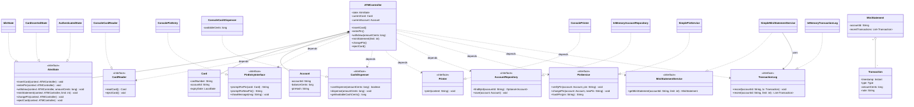

```mermaid
classDiagram
direction TB

class ATMController {
  -state: AtmState
  -currentCard: Card
  -currentAccount: Account
  +insertCard()
  +enterPin()
  +withdraw(amountCents: long)
  +miniStatement(limit: int)
  +changePin()
  +ejectCard()
}

class Account {
  -accountId: String
  -balanceCents: long
  -pinHash: String
}
class Card {
  -cardNumber: String
  -accountId: String
  -expiryDate: LocalDate
}
class Transaction {
  -timestamp: Instant
  -type: Type
  -amountCents: long
  -note: String
}
class MiniStatement {
  -accountId: String
  -recentTransactions: List~Transaction~
}

class CardReader <<interface>> {
  +readCard() Card
  +ejectCard() void
}
class PinEntryInterface <<interface>> {
  +promptForPin(card: Card) String
  +promptForNewPin() String
  +showMessage(msg: String) void
}
class CashDispenser <<interface>> {
  +canDispense(amountCents: long) boolean
  +dispense(amountCents: long) void
  +getAvailableCashCents() long
}
class Printer <<interface>> {
  +print(content: String) void
}

class ConsoleCardReader
class ConsolePinEntry
class ConsoleCashDispenser {
  -availableCents: long
}
class ConsolePrinter

ConsoleCardReader ..|> CardReader
ConsolePinEntry ..|> PinEntryInterface
ConsoleCashDispenser ..|> CashDispenser
ConsolePrinter ..|> Printer

class AccountRepository <<interface>> {
  +findById(accountId: String) Optional~Account~
  +save(account: Account) void
}
class InMemoryAccountRepository
InMemoryAccountRepository ..|> AccountRepository

class PinService <<interface>> {
  +verifyPin(account: Account, pin: String) void
  +changePin(account: Account, newPin: String) void
  +hashPin(pin: String) String
}
class SimplePinService
SimplePinService ..|> PinService

class TransactionLog <<interface>> {
  +record(accountId: String, tx: Transaction) void
  +recent(accountId: String, limit: int) List~Transaction~
}
class InMemoryTransactionLog
InMemoryTransactionLog ..|> TransactionLog

class MiniStatementService <<interface>> {
  +getMiniStatement(accountId: String, limit: int) MiniStatement
}
class SimpleMiniStatementService
SimpleMiniStatementService ..|> MiniStatementService
SimpleMiniStatementService --> TransactionLog : uses

class AtmState <<interface>> {
  +insertCard(context: ATMController) void
  +enterPin(context: ATMController) void
  +withdraw(context: ATMController, amountCents: long) void
  +miniStatement(context: ATMController, limit: int) void
  +changePin(context: ATMController) void
  +ejectCard(context: ATMController) void
}
class IdleState
class CardInsertedState
class AuthenticatedState
IdleState ..|> AtmState
CardInsertedState ..|> AtmState
AuthenticatedState ..|> AtmState

ATMController *-- AtmState
ATMController o-- Card
ATMController o-- Account

ATMController ..> CardReader : depends
ATMController ..> PinEntryInterface : depends
ATMController ..> CashDispenser : depends
ATMController ..> Printer : depends
ATMController ..> AccountRepository : depends
ATMController ..> PinService : depends
ATMController ..> MiniStatementService : depends
ATMController ..> TransactionLog : depends

MiniStatement "1" o-- "*" Transaction
```

